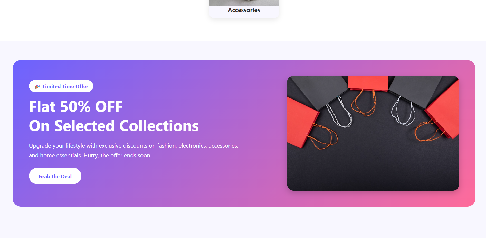
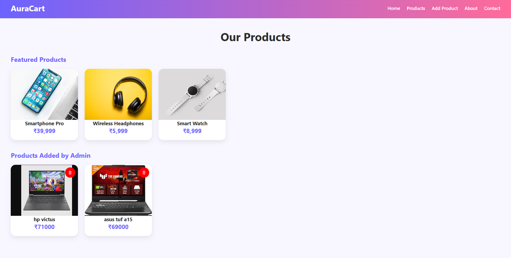
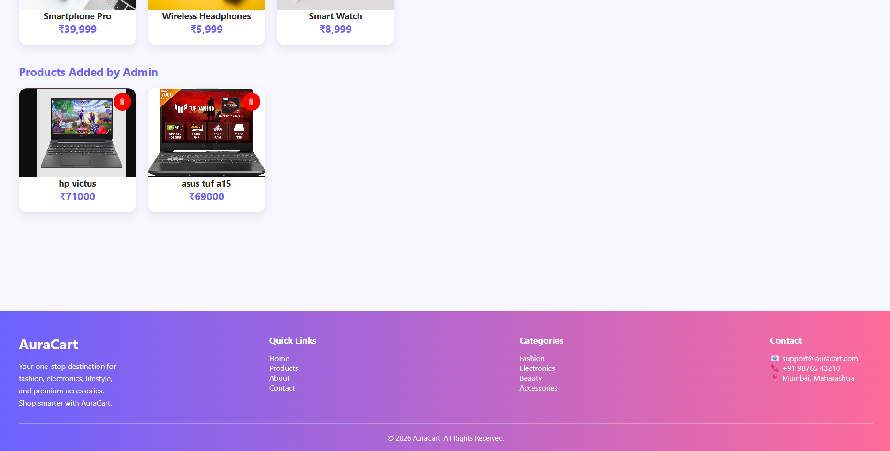
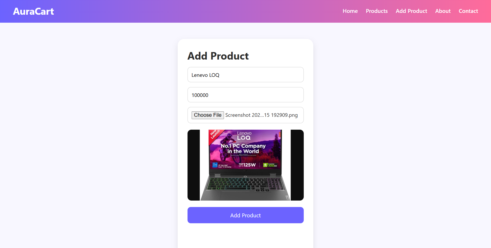
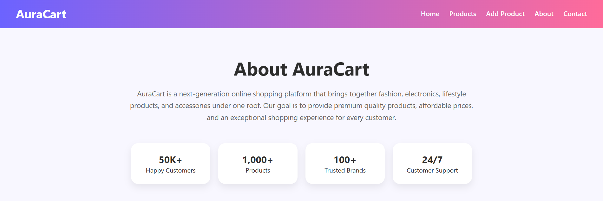
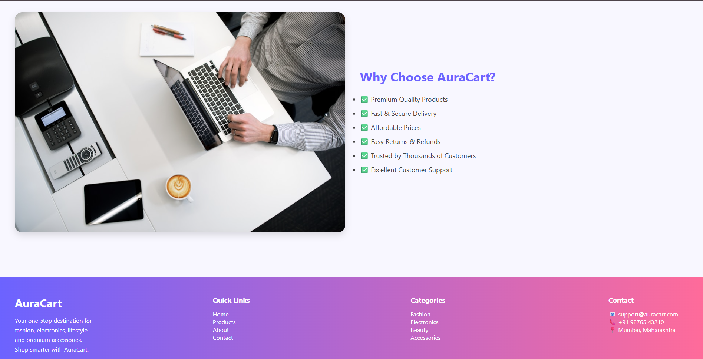

# 🛒 AuraCart

A modern React-based E-Commerce website developed using **React.js**, **Vite**, and **Supabase**. It supports CRUD operations with image upload functionality and dynamic product management.

## 📸 Project Screenshots

### Screenshot 1

### Screenshot 2

### Screenshot 3

### Screenshot 4

### Screenshot 5

### Screenshot 6

### Screenshot 7

### Screenshot 8

### Screenshot 9

### Screenshot 10

## 🛠️ Technologies Used

* React.js
* Vite
* React Router DOM
* Supabase
* JavaScript
* CSS

## 👨‍💻 Developed By

**Sanket Rathod**
